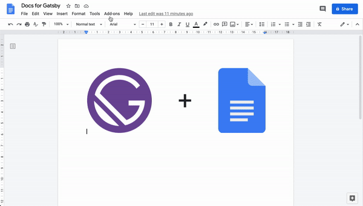

  <h1>Docs for Gatsby</h1>
   
  

    
  

   

[![Google Clasp][badge-clasp]](https://github.com/google/clasp)
[![PRs welcome][badge-prs]](#contributing)
[![MIT license][badge-licence]](./LICENSE.md)

---

**Docs for Gatsby** add-on help you manage your documents metadata and publish your [Gatsby](https://www.gatsbyjs.com) website, when using [gatsby-source-google-docs](https://github.com/cedricdelpoux/gatsby-source-google-docs) plugin,
directly from [Google Docs](https://drive.google.com/).

## Installation

> 🤚🏻 This Add-on is not on the **Google Workspace Marketplace** yet.
>
> ⏳Publishing is in progress

Install **Docs for Gatsby** from the **Google Workspace Marketplace**.

Select Install to begin using it in **Google Docs**.

## Usage

### Edit metadata

### Publish

1. Configuration (one time)

2. Trigger build

## Contributing

-   ⇄ Pull/Merge requests and ★ Stars are always welcome.
-   For bugs and feature requests, please [create an issue](https://github.com/cedricdelpoux/google-docs-for-gatsby/issues/new).

See the [Contributing guide](./CONTRIBUTING.md).

## License

This project is licensed under the MIT License.

See the [LICENSE](./LICENSE.md) for details.

## Privacy Policy

**Docs for Gatsby** respect your privacy and do not keep any data.

See the [privacy policy](./PRIVACY.md)

## Terms of service

See [Terms of service](./TERMS.md)

[badge-licence]: https://img.shields.io/badge/license-MIT-blue.svg?style=flat-square
[badge-prs]: https://img.shields.io/badge/PRs-welcome-brightgreen.svg?style=flat-square
[badge-clasp]: https://img.shields.io/badge/built%20with-clasp-4285f4.svg?style=flat-square
